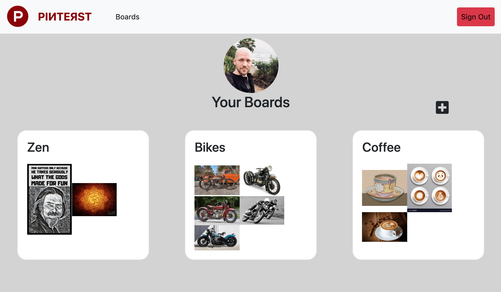
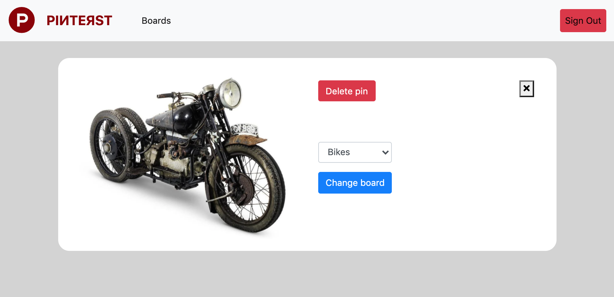
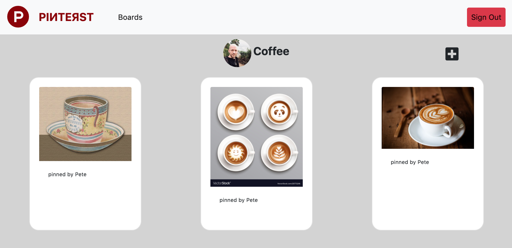

# PIИTEЯST
A single-page web app built with HTML , BOOTSTRAP, SASS, and JS that allows users to post images as "pins" which are organized into "boards". This was built as a group project assignment during my enrollment at [Nashville Software School](http://nashvillesoftwareschool.com/) while we were learning to use Firebase, Axios, and CRUD.

## Feature List
* User authorization with Google
* User can create pins and boards
* User can delete pins and boards
* User can re-assign pins to different boards

## Screenshot

## Developer
* Pete Stewart : https://github.com/petestewart72

## How To Run:
> Project is deployed at [https://chatty-hitchhiker-66a0d.web.app/](https://chatty-hitchhiker-66a0d.web.app/)

## Backlog
- [ ] Allow user to upload profile pic
- [ ] Make responsive for smaller screens
- [ ] Bug: occasionally the change board dropdown menu is unpopulated

## Technologies Used
  
